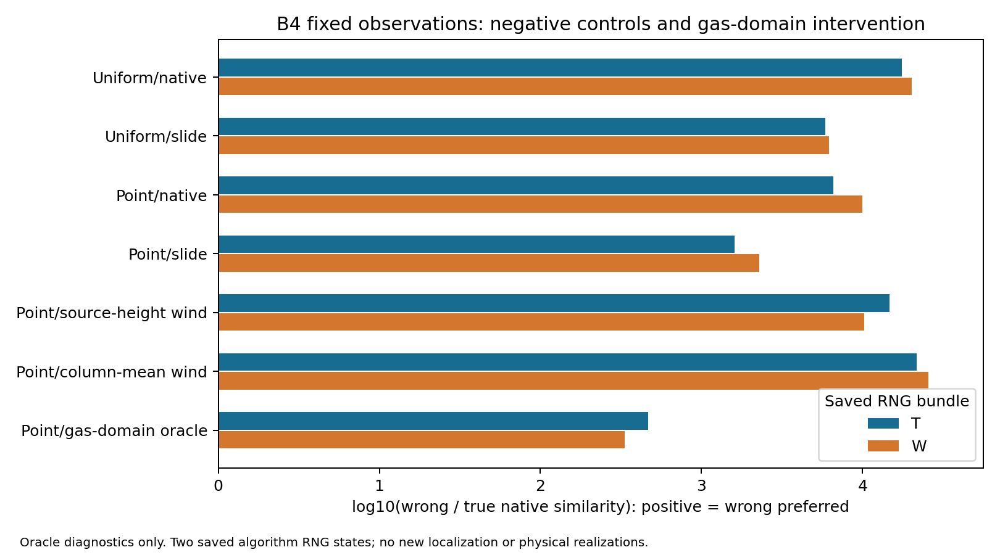

# B4 根本失败机制的代码与新实验复核 M3

## 先给结论：已经找到实际参与错误评分的结构因素，尚未把全部失败唯一归因

这轮不是再次复算旧M0/M1，也不是仅把结果标HOLD。新增28次隔离原生二维前向：24次科学干预、4次必要的逐图/释放点/随机状态一致性锚点。另对已有M2八份三维路径做五种读出反事实、共同中心字段评分及完整高度/几何投影审计。没有新气体、CFD、ROS定位或网络训练。

**最具体的发现是：PMFS把机器人二维导航自由域同时作为气体运动域。B4里大量合法三维气体中心的XY投影落在该域之外，因此模型中根本不能经历真实三维路径的部分投影。把气体运动域与导航域分离的诊断，使真源评分在两组固定随机初态下恢复约50倍，错误源优势显著下降。这个传播支撑假设确实参与当前评分偏差。**

但诊断结果仍选错误源：错误/真源评分比从21729.75/25553.94降至467.11/334.67，没有翻转。不能宣称已经找到了唯一物理根因、正式修好定位或验证了主创新。现在的结论具体到已证实因素与被否证的单因修复，而非整个研究一律HOLD。

## 原始结果及输入不变

B4官方原生success=true、最终方差约0.329、Top-5%误差约5.112m和原始错误集中后验保持冻结。这轮没有修改或重新更新那张后验。M1、M2、B4原始包和内部哈希保持；M2所用八个独立RNG物理bank仍为每源两参考、两留出。新M3算子分析复用了已看过的留出，属于探索性机制诊断，不能说是新的未见任务验证。

所有评分使用同一冻结B4最终50块观测及其447个自由格概率/置信度、D=0.4。50块来自10个停留，不能作50次独立释放。表中score是原生相似度乘积，不是合格物理联合似然；比值也不是归一化后验、定位误差或独立实验效应。

T/W是两组已保存PMFS随机引擎/Gaussian缓存初态，不是两次独立物理实验。运动改变后存活、步数和随机读取会分叉，因此不能声称逐粒子噪声完全配对。精确真源点只作oracle控制，不是源盲部署输入。

## 1. 先排除接线与实现的两种假根因

- 原生风来自传感器高度z=-0.2m。447格u/v与官方CFD10同位置查询逐值完全一致，最大差0。没有证据支持这次风场被错误接到z=0。
- GADEN的YAML噪声0.02在构造函数乘10，再乘dt=0.1；PMFS为0.2×0.1。水平记录阶段位移标准差均0.02m。不能把表面参数差写成十倍噪声错误。

代码与行号在`forward_contract_audit/FORWARD_CONTRACT_DIFFERENCE_TABLE.csv`和`source/`，风复核在`SAVED_WIND_PROJECTION_CHECK.json`。

## 2. 新二维干预的全结果，不能只挑改善项

| 冻结观测下的前向条件 | T 错/真原生评分比 | W 错/真原生评分比 | 两组排序 |
|---|---:|---:|---|
| 原1×1均匀源、原生遇墙停止，旧结果复用 | 17547 | 20181 | 都错 |
| 均匀源、切向滑动，新前向 | 5868 | 6207 | 都错 |
| 精确点源、原生遇墙停止，新前向 | 6605 | 10006 | 都错 |
| 精确点源、切向滑动，新前向 | 1598 | 2292 | 都错 |
| 点源、释放高度z=-0.5风平面 | 14715 | 10228 | 都错 |
| 点源、自由柱统一平均风，原导航运动域 | 21730 | 25554 | 都错 |
| 同上，但气体运动域改为3D自由柱并集 | 467 | 335 | 都错 |

完整精度在`ALL_FORWARD_SOURCE_PREFERENCE.csv`。图示为log10(score错/真)，不是物理概率。

壁面干预确实改变了路径：T真源uniform录制零位移136553/299603=45.58%，切向滑动后降到0，原始非零预测格110→127，真源评分约升3倍。故不能解释为补丁未生效；但滑动、点源及二者联合都不足以恢复排序。

固定释放高度与柱平均风也都未修复。这直接否证“只换一个更正确的固定风平面就能恢复”的解释。释放高度真源分支按原生规则预热500步，其他多数分支200步：设置未调，但实际步数/释放数不同，全部记录。未追加一个挑选效果的高度或随机种子。

## 3. 气体可达域与导航域的混用：源码、实际状态、反事实形成证据链

原生`Simulations::moveAlongPath`中的freeAt和visibility来自导航/测量图的二维occupancy；该图也用于候选支持、评分格和blur分母。机器人不能走到的XY位置会被当作气团不能经过。三维源投影合法并不能保证整个三维气体路径的投影合法。

392份已保存查询帧共457736条相关粒子—快照记录，按原生GADEN占据索引均在3D自由体素；其中297006条（64.89%）投影到二维图内非自由格。重复快照计数不是独立样本，也不是质量比例或65%的失败原因。另1172条在严格声明AABB外但仍满足原生trunc/取整体素索引自由谓词，单独保留，不悄悄更换合法性定义。

新干预保留447格候选、测量、评分和读出mask，仅气体运动freeAt及气体visibility独立。对新增运动区域，风用生成前冻结的完整自由柱均值；原447格u/v与前一柱均值分支完全相同，两个禁用干预锚点证明补充的非可达风值不改变旧分支。非导航格计数在blur前归零，运动、删除和随机读取照常，避免未归一化障碍计数回灌。

真源评分T从1.1941e-9升至6.0322e-8（50.51倍），W从1.1527e-9升至5.6614e-8（49.11倍）。错误源评分分别仅变为1.086倍与0.643倍。错误相对优势减少约46.52倍/76.36倍；自然对数评分差减少3.840/4.335。这是固定柱平均风条件下对原生评分的实质干预效应，不能把对数差比例解释成物理原因占比，也不能当成原始B4传感器风平面上的修复成绩。

本组八份旧/新分支实际预热均200步、记录均200步、释放均2000点，排除了本组预热时长变化解释。新域内真源粒子录制端点有约40%处于导航非自由格，错误源约20%；逐段跨导航障碍及出界计数完整记录。路径生存与Gaussian序列仍会分叉，不把两初态误称为独立物理重复。

该3D柱并集在本frame内1530格全通行，可能跨越实际不连通的高度层；它是宽松的气体支持上界，**不是恢复了真实三维输运**。即便这种oracle放宽仍偏错，导航支撑限制不是全部原因。后续不能直接把本mask当新算法部署。

## 4. 固定高度的二维状态为何不闭合：已有真实三维状态证据

B4观测期始终CFD第10帧，不能拿本例证明时变风历史失配。但静态三维风也不意味着投影到XY后的过程只依赖XY。

预设关键y=1.7–2.7m带内且二维合法支持的50997条中心状态：z中位0.6277m，离传感器高度绝对差中位0.8317m。同一个0.1m CFD XY体素上，用实际Z查询与用z=-0.2查询，水平风差中位0.10254m/s；实际水平速度中位仅0.04665m/s。可比较方向中36.71%位于相反半平面。

进一步固定相同细CFD XY，在两源各至少20条相关状态的全部303个体素中，源条件高度分布JS中位0.38990bit，平均高度差中位0.25914m，由该条件混合得到的水平风均值差中位0.02371m/s。未按定位效果挑体素、未把粒子或格当独立实验作显著性检验。

因此，一个对所有源共享的固定二维风切片不能表达这份真实数据中的源条件高度/漂移历史。这是明确的状态表示问题；没有再积分仅w/浮力的合法反事实，故不能把这一项单独宣布为剩余错源偏好的唯一原因。

## 5. 读出和证据聚合也参与比较，不能全部归给物理轨迹

对同一八份三维路径，只改预先固定的五种读出，原B4事件的log/Brier都选真。PID及全高度同XY中心事件在复用四份留出上均4/4；窄高度带2/4，同格浓度裁剪3/4，无增长核4/4。单纯“中心事件代替PID”在本原始事件对照中没有制造原生错源排序。

但同一三维中心场放入原生dense相似度时：导航非自由格先清零+原生blur的log相似度真−错=-0.50891，弱偏错；保留全部XY中心作blur分子时为+0.12273，弱偏真。后者仍用旧导航mask卷积作分母和clamp，并非完整物理模型。原始受体中心事件log真−错=+1.32950。

这表明读出支持与全图比较可以改变这一条件对照的排序；不能混写成“三维预测无论怎么评分都选真”。几个弱边际不能与原生上万倍错源优势直接做百分比因果分解。

另绕过累计地图、仅在实际受体格读取旧2D频率代理时，Brier仍偏错：T真/错0.835/0.409，W0.841/0.409。未平滑Bernoulli两边都−∞，必须报告TIE；只有事先固定的伪计数敏感性给出有限偏错log。这些频率不是合格PID事件概率，所以结果只能排除“该2D代理必须经过累计图才错”的说法。

## 6. 现在能下的根因判断及剩余边界

**已定位并有干预支持：** 气体运动域被二维导航支撑限制，实质压低了当前真源评分；真实三维状态又存在高度条件漂移，投影状态和读出并不等价。原生乘积评分随后把这种源条件预测差异变成强烈错误相对偏好。这是具体、可指代码和原始状态的链条。

**已否证充分性：** 候选区域混合、遇墙停滞、选错固定风高度、导航气体域限制，任一已测试的单项或点源+滑动组合都不能单独修复本例排序。不能只加概率下限、只换一个风面或只放宽地图就宣布创新成立。

**尚未独立隔离：** 原生50中心/s与物理7/s的存量/命中饱和，40–100秒预热/20秒统计与三百多秒连续气体年龄历史，隐藏Z/w/浮力/三维连通、质量浓度读出与累计belief的比较、相关空间证据及自适应细分的交互。没有在结果后再追加这些分支。最可信的下一步是按一个明确的状态/观测合同建立对照，不能把四类混杂揉成一个万能新网络。

本次没有证明某个新方法定位更好，也没有新的闭环终态。正式主创新及跨源/跨场景适用范围仍需要独立任务。科学上保持这条限制，同时明确承认我们已取得实质根因分诊，而不是再次把所有事实归为未知。

## 交付和复核

根目录`verify_combined.py`先核验全部文件SHA，再运行冻结M2和M3的只读验证。M3复核重新计算算子、中心字段、代理评分、392帧高度统计及原生前向结果；只在系统临时目录写派生表，不调用VM/ROS/GADEN或新前向。NumPy/OpenCV是复核依赖，运行前不自动安装软件。

所有逐格评分、原始blur前/后图、释放点、RNG相位、运动计数、输入字段、补丁、独立源码审查及失败对照均保留。28次前向累计约8.70秒，最大RSS约138.6MiB；两次隔离编译各约22秒、RSS约0.85GiB。远端三个M3目录累计202211985字节（含编译产物）：初始200000000字节上限对应第一factorial子目录，该目录100247425字节；后续合同单独冻结，不能把全M3误报为小于200MB。没有清除证据。运行已停止，官方原始后验和历史判决未改。请先阅读联合包根目录`FIRST_READ_FOR_PRO_zh.md`再审查详细表。
