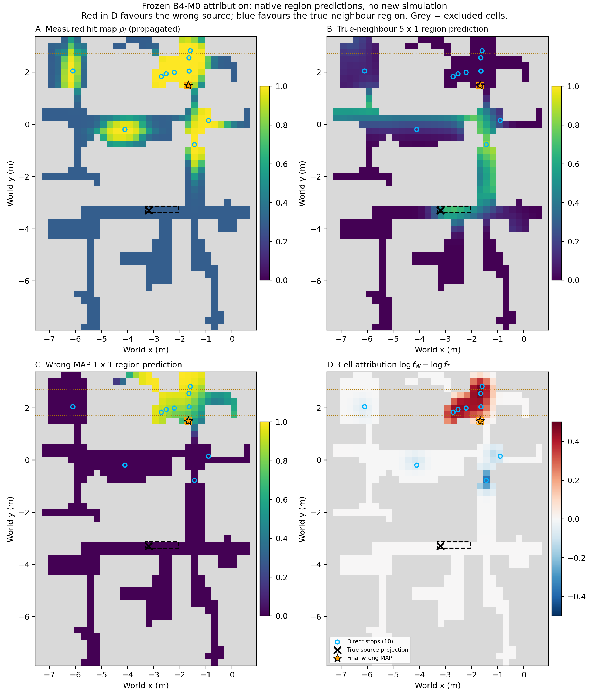
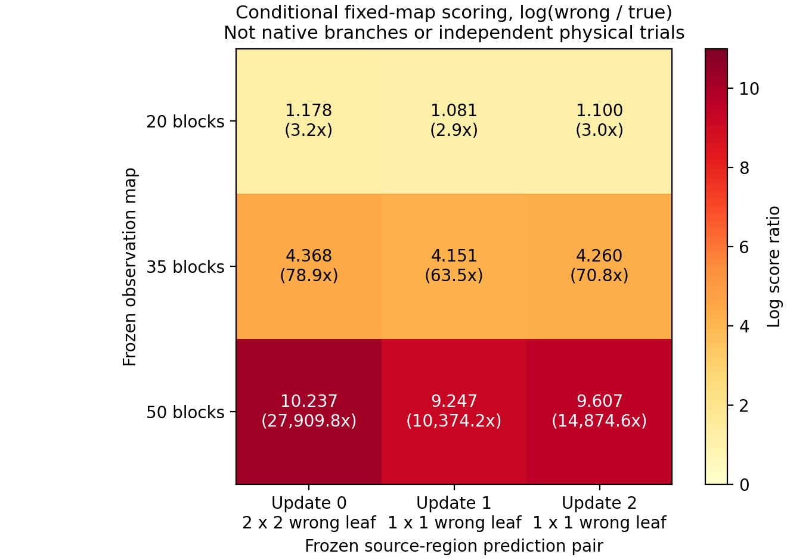

# B4-M0 离线空间证据归因

判决：`B4_M0_ARITHMETIC_ATTRIBUTION_PASS / PHYSICAL_CAUSE_HOLD`。

最终错误峰值与真源邻近区域的原生评分比复算为 **14,874.598695 倍**。你预先指出的 **y=1.7–2.7 m** 区域，贡献净对数评分差 **9.040297 / 9.607410 = 94.097%**。这些位置的高检出测量地图与错误源预测更匹配，而与真源邻近粗区域预测强烈不一致。

这已经解释“保存的二维模型为什么选错”，尚未证明“真实三维传播为什么造成错误”。本轮没有启动虚拟机命令、ROS、GADEN、CFD、新源更新、定位goal或训练；旧 E3/B4、R7/D0/D1及历史 M0/M4 STOP 判决不变。这里的 B4-M0 是新命名的冻结证据诊断，不是重启旧 M0。

## 1. 固定证据与算术一致性

父证据提交 `c2aacbac7fb2ef7be4be3c9c7dcfce20c11f823c`；原17.82 MB ZIP SHA256：`8f7a6c27265b16eab40b549b2c6b3887fe3e4e28eb7e6abb8302a750414d29f7`。父包 **1475项**清单在本轮分析前后逐项核验。采集链属于已审核 N1工程对齐版本，保持上游核心与官方B4参数冻结，不重新称为N0作者历史原样运行或论文30次统计复现。

三次更新全部388张原生命中图评分重算通过，NumPy路径最大相对误差 2.05e-15，三张后验最大绝对误差 1.11e-16。另一个**不导入主脚本**的Python标量/45位Decimal检查同样核验388项，最大相对评分误差 8.82e-19。

原生最终 `success=true`、方差0.329068和Top-5%误差5.111584m保持原判。关闭阶段-6作为独立工程问题留档。本轮只检验评分与证据，不重新定义成功门。

## 2. 每格贡献的定义及最终结果

对自由格 i，按冻结源码：

`p_i = 1 - 1/(1 + exp(logOdds_i))`

`f_i(s) = lerp(1, 1 - 0.4*abs(p_i-h_i(s)), confidence_i)`

`delta_i = log(f_i(W)) - log(f_i(T))`

其中 W 是本次最终错误MAP所在的原生候选叶，T 是包含真实源投影的原生粗候选叶。delta>0支持W，delta<0支持T。**这是源码评分乘积的对数分解，不是经过独立资格化的物理似然比。** 仅自由格进入评分；障碍格不计，零置信格的贡献为零。

| 项目 | 真源邻近候选 T | 错误峰候选 W |
| --- | --- | --- |
| 原生候选ID | `quadtree_17_18_5_1` | `quadtree_23_37_1_1` |
| 区域大小 | 5×1格，即1.25×0.25m | 1×1格，即0.25×0.25m |
| 评分 | 5.18812753476e-10 | 7.7171315059e-06 |
| 单格后验 | 2.14010948469e-05 | 0.318332697485 |
| 整叶后验质量 | 0.000107005474234 | 0.318332697485 |
| 最小单格评分因子 | 0.607601566 | 0.654976958 |

单格后验比与评分比同为14,874.598695；**整叶质量比只有2,974.919739**，因为T覆盖5格。不能用不同区域的单格概率比冒充同分辨率、同源点的物理比较。

T区域边界约 x=[-3.30,-2.05]、y=[-3.38,-3.13]m，真实源XY=(-3.2,-3.3)。保存的2000个释放采样点均在该矩形内，均值约(-2.6724,-3.2551)。**T模拟的是区域内随机释放混合，不是精确真实源XYZ的参考输运。** 2000个丝团释放点也不是2000次独立实验。

最终245个自由格具有正置信度；69格支持错误候选，176格支持真源邻近候选，202格贡献为零。支持W的正贡献合计 **12.775117**，支持T的负贡献合计 **-3.167707**，相加为 **9.607410**。不是全图所有证据都偏向错误源，而是正贡献在乘积评分中占优势。

D=0.4下没有任何硬零评分因子，T的最小因子仍约0.608；本次错误集中不能用旧H02的D=1硬零链解释。

图中灰色是排除格，蓝圈是10个真实停留位置；测量地图包含空间传播估计。D图红色支持W、蓝色支持T；水平虚线标出用户预先提出的y带。世界坐标使用保存原点和0.25m格中心，与原生float32舍入有亚微米级差异，不影响分区或评分。

最大正贡献格如下；第一格在y=2.745m，位于预设带外，因此没有为提高占比而事后扩大区域。

| 平铺索引 (i,j) | 格中心XY(m) | 测量概率 | 置信度 | T / W预测命中率 | 对数贡献 |
| --- | --- | --- | --- | --- | --- |
| 1451 (23,42) | (-1.675,2.745) | 0.99999655 | 0.960424 | 0 / 0.970994 | 0.473577 |
| 1417 (23,41) | (-1.675,2.495) | 0.99999974 | 0.970211 | 0 / 0.936394 | 0.466166 |
| 1346 (20,39) | (-2.425,1.995) | 0.99999974 | 0.981000 | 4.0672267e-06 / 0.870003 | 0.445878 |
| 1311 (19,38) | (-2.675,1.745) | 0.99998986 | 0.944564 | 0.00015682516 / 0.899331 | 0.435660 |
| 1345 (19,39) | (-2.675,1.995) | 0.99999361 | 0.932145 | 1.0022867e-06 / 0.915381 | 0.434521 |
| 1347 (21,39) | (-2.175,1.995) | 0.99999981 | 0.974710 | 1.1487104e-05 / 0.846490 | 0.432382 |
| 1416 (22,41) | (-1.925,2.495) | 0.99999861 | 0.900532 | 0 / 0.956556 | 0.430847 |
| 1383 (23,40) | (-1.675,2.245) | 0.99999958 | 0.942963 | 0 / 0.886793 | 0.429867 |

在预设带内65个自由格，正贡献9.425024、负贡献-0.384727、净贡献9.040297；带外净贡献0.567113。94.1%是**净评分差份额**，不是“94.1%的物理证据已经证实失配”。完整正负格及固定1m分带在 `derived/*CELL_ATTRIBUTION.csv`、`*REGION_ATTRIBUTION.csv`。

## 3. 测量传播与覆盖边界

50块观测全为正检出，分属10个停留位置；同站5块时间相关，不能当作50个独立物理样本。最近停留点为索引6（第7处），到真源距离 **3.077051m**。这说明没有近源观测，但不能单凭全正检出宣布源位置不可辨识。

最终10个直接停留格净贡献2.076853；其余437个自由格净贡献 **7.530558，占78.383%**。后者来自地图中直接停留格之外的证据，其中包含官方 `EstimateHitProbabilities` 的空间传播与累计。它们不是437个额外传感器位置，也不是独立观测。

真源所在格的测量置信度在三次快照均为0，该格自身不提供排除因子。真源评分低来自其他受体格的预测冲突，而不是“没有在真源测量就直接判零”。是否存在重复利用相关传播证据，仍需独立受体物理预测和相关性对照，当前HOLD。

源码确实先用气体阈值0.1得到hit布尔量，再更新测量图；原始浓度幅值不直接进入当前评分公式。幅值是否提供额外源判别信息，本轮没有合格的多源三维参考库，不能从50次真实源观测独立证明。

## 4. 三次更新：固定物理区域与随机/细分边界

以下始终追踪真实源叶和**最终错误峰坐标所在叶**，不把首轮另一个MAP位置偷换为同一源。首轮当前MAP为(-1.175,-0.255)m，当前MAP配对结果另存CSV/JSON。

| 更新 | 累计观测块 / 停留数 | T / W叶格大小 | W/T评分比 | 净对数差 | 预设带净贡献 |
| --- | --- | --- | --- | --- | --- |
| update_0 | 20 / 4 | 5×1 / 2×2 | 3.24751 | 1.177889 | 2.340356 |
| update_1 | 35 / 7 | 5×1 / 1×1 | 63.5132 | 4.151248 | 4.252528 |
| update_2 | 50 / 10 | 5×1 / 1×1 | 14874.6 | 9.607410 | 9.040297 |

三个 `coarse_tree.csv` **字节SHA256完全相同**，三份已保存二维风向量场也逐值完全一致（最大差0）。源码每次以 `localCopyLeaves=QTleaves` 开始，在该局部副本上细分。因此：

- 单次更新内，“评分高→更多细分→重新模拟→局部后验集中”的程序路径确实存在。
- 但**细分树不会从上一源更新直接遗传到下一源更新**。不能把本例解释为同一棵错误细分树跨更新持续被强化。
- 原生源图是当前累计测量图的候选评分重新归一化，`prior_posterior`没有在这个源码路径中再次逐格乘入评分。历史影响通过测量地图和运动采样进入，不能把它写成旧源后验又被直接重复相乘。
- T始终停留在5×1区域；W从2×2变为1×1。记录可证明预算/分辨率不同，但不能仅凭该事实证明有害细分偏差。

全部候选随机状态、释放点、模糊前后命中图、粗/细树、原始评分和后验在小包内原样保留。本轮不执行新前向模拟，无法隔离有限随机样本方差或精确源点与粗区域混合的效应。

## 5. 仅用已有预测图的配对评分

将三份观测地图分别与三份冻结T/W预测图配对。此表固定最终错误峰物理区域，分辨率随预测库原生记录而异。每格为W/T评分比：

| 观测图 | update_0预测对 | update_1预测对 | update_2预测对 |
| --- | --- | --- | --- |
| 20块 | 3.248 | 2.949 | 3.003 |
| 35块 | 78.869 | 63.513 | 70.779 |
| 50块 | 27,909.830 | 10,374.236 | 14,874.599 |

三份已有预测库在20块观测下仅偏向W约3倍，在50块地图下均偏向W约1.04万–2.79万倍。**固定第一批预测图也能得到更强的最终错误偏好，故重新随机模拟/细分并非产生强错误评分偏好的必要条件。** 这个结论只对已保存预测库和区域成立，不外推到精确真源三维预测。

这不是三个独立实验，也不是替代原生运行分支：预测库受原生观测和细分选择影响；观测图累积同时改变概率与置信度；同一真实气体realization及轨迹被固定。端点变化有非零交互，不能宣称已经唯一分离“观测、随机性、分辨率”的因果百分比。表中没有新官方success、方差或定位成绩。

## 6. 本轮决策

| 问题 | 判决 |
| --- | --- |
| 哪些空间区域造成保存模型偏向错误源 | PASS：预设y带是主要净贡献区 |
| 原生数值评分/归一化是否一致 | PASS：388评分、3后验及独立Decimal检查通过 |
| D=1式硬零是否为本次原因 | 排除：当前D=0.4，因子均正 |
| 错误细分树是否跨更新保留 | 排除这一具体说法：粗树每次重新开始 |
| 空间传播地图是否导致信息失真 | HOLD：目前只有算术归因 |
| 有限前向随机模拟是否为唯一原因 | 冻结库条件对照不支持“唯一原因”；独立随机方差归因HOLD |
| 精确真源 vs 区域混合是否造成偏差 | HOLD：没有精确真源参考前向记录 |
| 真实三维输运失配 / 源不可辨识 | HOLD：没有合格的候选条件物理对照 |
| 时变风历史失配 | 本例未测试：定位期固定第10帧 |

下一步只提交最小机制区分方案，不启动实验。优先在同一冻结观测、同一受体位置和预算下，建立**精确/统一分辨率候选源**的受控二维预测与**真实高度一致的三维参考**，同时记录观测可辨识性。如果参考预测也无法区分源，不能宣称二维失配；如果仅改变源区域或随机性就消除偏好，也不能归因三维物理。所需新生成资产先给出预算并等待授权；不得用真实源位置指导机器人采样或事后调阈值。

M0结束，保持 `PHYSICAL_CAUSE_HOLD`，等待独立审核，不自动追加闭环、seed、B4重跑或方法训练。
