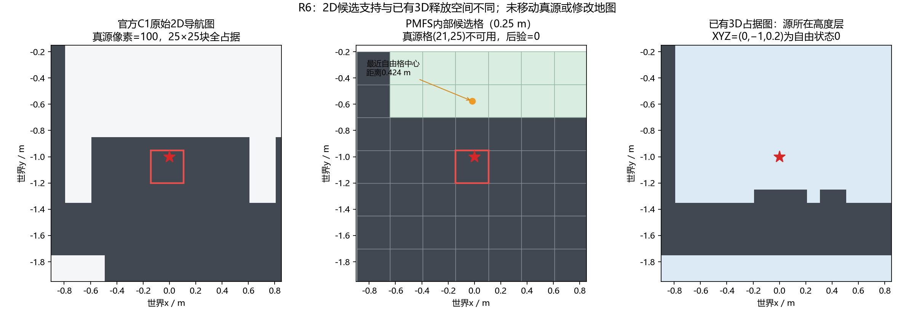

# PMFS R6：官方场景对齐与失败分诊

日期：2026-10-09。结论：**官方二维地图对齐 PASS；生成器参数读取修正 PASS；获批的一次干净 C1 生成及源/几何/无循环风核验 PASS；原生播放与物理时间等价关系 HOLD；传播模型科学缺陷 UNRESOLVED。** 本轮执行了用户后续批准的一个C1生成，未执行CFD或新定位实验，保留 R4/R5 与既有 STOP 判决。

## 二维图为什么不同：需要更正先前的表述

**R5 实际收到的 ROS 二维地图已经与固定版本官方 C1 `_occupancy.pgm` 逐像素相同。** 不是拿旧 VGR 图冒充官方图。约 **4.0003%** 的差异比较的是“旧 VGR 二维图”和“官方二维图”。本轮继续保留官方图，不重画、不移动源、不添加真源候选。官方资产固定于 GSL 提交 `4e141e162551e674f2f30ddb8859136c72139aac`；[官方地图原件](https://github.com/MAPIRlab/GasSourceLocalization/blob/4e141e162551e674f2f30ddb8859136c72139aac/Environment_config/PMFS/scenarios/C/_occupancy.pgm)及 YAML 已收进审核包。

另一项差异是二维导航占据与三维释放空间的表示不同。已有三维图在真源 `(0,-1,0.2)` 的体素为 Free；官方二维图在同一 XY 点为占据。旧二维图的自由掩膜恰好等于已有三维图 z 索引 3 的切片放大结果，该层高度为 `[-0.70095,-0.60095)` 米；真源高度在更高的自由层。**这能解释两种表示为何可以同时成立，但不能证明官方地图当时采用了哪个生成脚本，也不能仅凭占据值认定具体障碍物是墙或家具。** 官方二维图的完整制作历史仍未知。

## 真源的候选支持

R5 源网格为 33×47，0.25 米。真源落在 `(21,25)`，该格自由标志和后验均为 0。对应官方细网格的 25×25 区域全部 625 个像素均为占据，不是坐标原点错位或仅边缘降采样造成。上游降采样规则要求块内全部像素自由才允许该粗格自由；可达性裁剪另排除 13 格，真源在裁剪前已被排除。[上游规则](https://github.com/MAPIRlab/GasSourceLocalization/blob/4e141e162551e674f2f30ddb8859136c72139aac/gsl_server/src/gsl_server/algorithms/Common/Grid2D.hpp#L120)

实际 PMFS 候选生成路径中未找到“将已知真源投影到邻近自由格”的专用政策。相邻自由候选可以近似表示位置，但没有自动保留真源坐标的转换。最近自由格中心距真源 **0.42449 米**，最近连续候选矩形支持距真源 **0.29912 米**；两者不是后验均值误差的下界，也不能据此断言近似定位必然失败。现阶段应保留作者规则并如实报告支持范围，而不是修改地图制造成功。详见 `SOURCE_SUPPORT_EVIDENCE.json`、`MAP_HEIGHT_REPRESENTATION_EVIDENCE.json` 与支持图。

## 为什么 300 秒只有一次源更新

源更新按完成的停留测量次数触发，并非正检出就立即触发。每处五个测量块后，在递增计数之前判断 `k>=5 && k%3==0`。因此第一次为 **第7处/k=6**，下一次为 **第10处/k=9**。R5 只完成九处，调度结果与实际生效参数一致。[上游触发代码](https://github.com/MAPIRlab/GasSourceLocalization/blob/4e141e162551e674f2f30ddb8859136c72139aac/gsl_server/src/gsl_server/algorithms/PMFS/PMFS.cpp#L168)

| 停留 | k | ROS绝对时间/秒 | 搜索已用时间约/秒 | 浓度范围/ppm | 正测量块 | 刷新源后验 |
|---|---:|---|---|---|---:|---|
| 1 | 0 | 13.7–15.5 | 0.4–2.2 | 0.018–0.021 | 0 | 否 |
| 2 | 1 | 32.9–34.8 | 19.6–21.5 | 0 | 0 | 否 |
| 3 | 2 | 84.0–86.0 | 70.7–72.7 | 0 | 0 | 否 |
| 4 | 3 | 109.2–110.9 | 95.9–97.6 | 0 | 0 | 否 |
| 5 | 4 | 127.3–129.0 | 114.0–115.7 | 0.081–0.091 | 0 | 否 |
| 6 | 5 | 197.0–198.8 | 183.7–185.5 | 13.889–13.984 | 5 | 否 |
| 7 | 6 | 213.1–215.1 | 199.8–201.8 | 0 | 0 | 是 |
| 8 | 7 | 265.1–267.0 | 251.8–253.7 | 13.396–13.461 | 5 | 否 |
| 9 | 8 | 299.6–301.5 | 286.3–288.2 | 12.945–13.095 | 5 | 否 |

唯一源更新在 ROS 时间 **215.1008 秒触发、221.9005 秒结束**。此前35块中有5块正检出；后来的10块正检出更新了测量图，但未进入新的源后验。

需要纠正：“ROS时间301.5秒超过300秒搜索预算”并不成立。搜索计时在初始化定位结束后开始；依据消息与日志交叉重建起点约为 ROS 13.265 秒，不确定度约±0.11秒，第九处最后测量对应已搜索288.24秒。预算在驶往第十处时到期。该时间换算是搜索时钟核验，**不代表已有气体帧物理时间已合格**。

九处之前导航区间合计260.50秒，日志共12次 `Failed to make progress`；其中最后一次位于未完成的末段导航。状态机配置有清图、旋转、等待和后退恢复，但缺少 BT/action 完整事件追踪，不能把区间全部归为恢复时间，或给各恢复动作虚构时长。未延长300秒预算、未调更新频率。定位失败仍不能在几何、调度与物理预测之间分配因果贡献。

## C1 资格与已经完成的修正

限定检查了登记的 VM 数据库17份记录和本机已知 House01/02 根目录8份记录，**25份中未找到完整合格的官方 C1/B1 记录**；不声称搜索了整个硬盘。VM C1 候选存在生成风序列循环；本机 C1 候选的文件头明确显示第22帧风索引10、第24帧回到1，与官方生成 `allow_looping=False` 不符。修改播放器循环开关不能改变已经生成的物理历史。其他记录还有释放点、风路径或长度问题。逐份判定见 `EXISTING_RECORD_QUALIFICATION.csv`，包内保留三帧原始小文件用于独立检查。

为执行“按官方来”的修正，本轮在**原有 VM**中新建隔离工作目录，准备了与固定官方提交字节一致的 C1 地图、CAD、11帧原始风场与配置。官方源码原件保留；隔离生成器修正了两个参数绑定：原包装把温度、压力都读成 `wind_time_step`，修正为各自参数名。两包编译成功，实际 ROS 参数读取验收得到温度298 K、压力1 atm、风步长1秒、源XYZ及其余C1参数正确。

准备阶段的参数验收程序在加载环境、启动物理模拟和建立结果目录之前返回；当时生成执行次数为0（`PREPARATION_CONTRACT.json` 与 `CORRECTION_BUILD_AND_PARAMETER_AUDIT.json` 记录该阶段）。初次验收因 `libbsc.so` 路径缺失退出127，补齐隔离启动库路径后退出0，失败记录保留。此修正证明当前包装正确读取参数，不能倒推出旧H02运行一定使用了错误温度，也不能当作作者历史原样版本。GADEN 固定于 `ccb02e959a45a188e4b6c78792e197633fc64f1c`；作者当年的精确依赖锁未提供。同样的参数绑定问题在一份较早官方候选源码中存在，日期接近不构成作者依赖证明。

随后用户明确批准“只生成并核验一个C1”。生成前发现旧共用core的版本和随机种子修改不符合当前固定官方GADEN声明，因此隔离导出该版本声明的core `1a20e35cd5f174ae9675a2ae3c796137a05c4ee5` 及递归submodule原件，重建后重新预处理并验收；旧环境没有覆盖。新生成采用默认随机状态，单线程，不选种子，实际加载隔离的新core。

**一个C1已经完成**：1803帧、源XYZ/气体编号/风索引全部逐帧核验，风0..10推进后保持10，无循环，原始官方资产未变。完整气体及风约136.55MB，实际生成约11.29秒。新增被动时间钩子记录保存调用内部时钟和推进后的时钟，未改输运或保存条件。实际保存间隔0.5–0.6秒，第500帧为267.3071秒；与恒定2Hz播放的物理时钟等价关系仍HOLD，未擅自修正保存规则或追加定位。详见 `clean_C1/CLEAN_C1_RESULT_zh.md`。

## 决策与交付边界

| 项目 | 判决 |
|---|---|
| R5实际二维地图与固定官方地图一致 | PASS |
| 真源二维候选排除的原因及更新触发解释 | 已查明，保留作者规则 |
| 隔离生成器编译及实际C1参数读取 | PASS |
| 现有气体记录满足完整C1生成合同 | HOLD |
| 后续获批的新C1：固定官方版本资产、依赖、源及无循环风 | PASS |
| 新C1保存时间轴 | 已完整记录；恒定2Hz播放的物理时间解释HOLD |
| 作者历史原样全系统性能复现 | HOLD |
| 原生传播模型独立科学失配证据 | UNRESOLVED |
| 一个干净C1生成 | 获批后已执行并核验，立即停止 |

`CLEAN_C1_EXECUTION_PLAN_zh.md` 保留执行前合同；获批后的依赖对齐与实际成本见 `clean_C1/`。本轮不再重复R5的108候选一致性检查、不运行新导航、不训练算法、不修改冻结开题报告或原始数据。复核脚本 `verify_r6_evidence.py` 仅读取包内文件，需要 Python、NumPy、Pillow；不需要 ROS/VM，不执行模拟。新增C1可用 `clean_C1/verify_clean_c1.py` 独立核验。源码逐行链接见 `SOURCE_LINE_EVIDENCE.json`。
