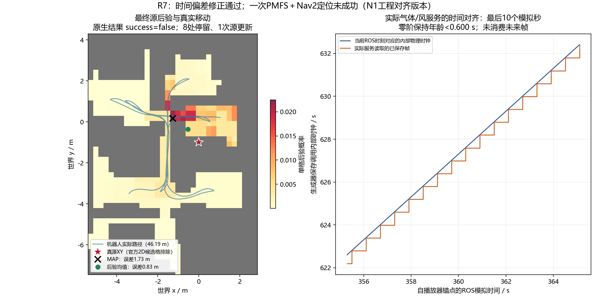

# R7：实际帧时间对齐与一次完整原生定位

**时间偏差已解决，完整定位已执行；本次定位失败。** 采用现有VM、一个新生成并已核验的C1记录，未再次生成气体、移动真源、修改地图或挑选随机种子。执行一个原生DoGSL目标，PMFS、传感器、GADEN气体/风服务、Nav2和真实机器人运动均实际运行。

## 实际结果

| 项目 | 结果 |
|---|---|
| 定位成功 | **false** |
| 搜索预算 | 300.001个ROS模拟秒 |
| 定位目标墙钟耗时 | 61.15秒，恢复官方BasicSim speed=5 |
| 实际运动 | 46.19米，8个完成的停留位置 |
| 处理测量 | 40块，其中25块正检出 |
| 原生源概率更新 | 1次，106个候选源模拟，完整状态已保存 |
| 最终MAP格中心 | `(-1.26773, 0.17412)`米，唯一最大值 |
| MAP位置误差 | **1.72792米** |
| 全后验均值 | `(-0.52660, -0.35689)`米，误差**0.83121米** |
| 原生前5%均值误差 | 1.39367米；不是MAP误差 |
| 最终方差/收敛阈值 | 4.36309 / 1.5，未满足声明条件 |
| 停止原因 | 原生300秒预算到期 |

Action协议状态4表示目标处理返回，不能替代 `result.success=false`。原生结果文件为 `FAILED -1 300.001 0.831207 1.39367 8 4.36309`，位置误差与保存后验独立重算一致。

## 怎么解决时间偏差

保持1803个原始气体帧不变。播放器读取生成时记录的实际内部保存时间，以第500帧267.307098秒为保存时钟锚点，按统一ROS模拟时钟选择**当前时刻及之前最近的已保存帧**。时间坐标沿用生成器保存调用的内部时钟约定；原代码在该步先释放/移动、后保存、再自增时钟，推进后时刻也已保存在R6侧车中。在气体和风服务回调内同步推进，保留相邻帧间的零阶保持，不插值伪造浓度，不加载未来帧，也不更改官方保存判断。

2786条真实播放记录、其中2206条气体/风服务记录全部通过独立检查：帧号与实际时间轴的查找结果一致，物理目标时间与ROS时钟换算的记录误差为0；没有累积播放速率漂移。已保存帧相对目标时间的最大保持年龄为0.59985秒，来自数据本身0.5–0.6秒的离散保存间隔，仍然保留这一采样限制。

另将风文件按编号0..10显式排序，消除官方目录枚举顺序不确定性。预检的实际风服务UVW与完整风文件第10帧相应体素逐值相同，最大差异0。运行结束后1803个气体文件SHA256全部不变。

## 官方配置与工程修正的边界

二维图问题已经闭合：本次实际ROS地图与固定官方PGM逐像素一致，R5也采用官方图。此前约4%的差异来自旧VGR二维图与官方图之间的比较，不能描述成当前图仍偏离官方。没有为定位结果修改障碍或真源附近的候选区域。

使用固定官方C1二维导航图、CAD与原始风CSV；GADEN、core和递归依赖采用R6已锁定版本。源 `(0,-1,0.2)`、释放、温压、阈值、D=0.3、初始探索5、每3步源更新、300秒参数和BasicSim speed=5保持固定官方设定。复用了已通过接口验收的时间戳TF、FROM/TO桥及原生PMFS被动记录钩子；PMFS评分、候选规则、运动策略和停止规则未更改。

**这是N1工程对齐版本的完整系统运行，不是N0作者历史原样配置复现。** 官方示例的GSL使用系统时钟；N1统一改为ROS模拟时钟，使定位预算、TF、运动与气体物理时间一致。因此本次300秒指模拟秒，不能冒充作者原样配置的300墙钟秒成绩。原始播放器仍保存在 `official_player.cpp`，原始启动差异见 `OFFICIAL_TO_N1_LAUNCH.patch`；没有抹去N0边界。

不能把本次误差与旧R5直接相减并归因于时间修正：新气体记录、生成依赖、风序列和BasicSim速度也发生了对齐变化。本轮是一次可追踪的复现运行，不是方法收益对照或独立重复实验。

## 为什么仍失败：已经能说什么

直接停止原因是方差仍高于1.5且预算到期。完成停留计数为k=0..7；按原规则第一次源更新在k=6（第7处），下一次要k=9（第10处）。唯一更新纳入前35块、20块正检出，第8处的5块强检出未再次刷新源后验。没有偷偷调低更新间隔或延长预算。

官方二维图仍把真源水平位置排除在候选支持之外；真源三维体素允许释放。这是R6已经查明的官方表示边界，本轮保持不动。它与有限更新共同限制结果，但**本次单例不能分配各因素的失败贡献，也不能证明PMFS传播模型的独立科学缺陷**。无需继续查找旧20条观测或旧随机状态；当前在线模拟图、候选采样、树与最终后验都已保存。

## 运行与交付

两个发送定位目标前的启动错误（可执行文件名、遗漏C1 YAML上下文加载）已修正并保留日志，原生目标发送次数仍为1。仅清理了这些失败启动的自有ROS进程组，未动其他域或另一任务环境。正式结果返回后，GSL退出阶段仍出现已有 `std::system_error: Invalid argument`/exit -6，属于结果之后的清理HOLD；定位返回与保存后验在此前已完成，不把它伪装成正常退出。

定位原始运行目录：`/home/zyc/pmfs_physical_clock_localization_r7_20261009`；完整气体记录仍在R6隔离目录。当前自有ROS域76进程为空，原VM保持运行。

复核：`python verify_and_summarize_r7.py`，需要NumPy和PyYAML；只读包内数据，不启动ROS或仿真。审核ZIP包含运行合同、实际生效参数、全部原生更新状态、原始消息/TF记录、概率图、时序、源码补丁和SHA256。之前STOP结果、冻结开题报告、原始GADEN/PMFS资产与R5/R6审核包保留。

最终判决：**PHYSICAL_PLAYBACK_ALIGNMENT_PASS / NATIVE_EXECUTION_PASS / LOCALIZATION_FAIL / ORIGINAL_HISTORICAL_PARITY_HOLD / SCIENCE_UNRESOLVED。** 完成本轮“解决时间偏差并执行到定位”的授权范围，停止追加实验，等待复核。
